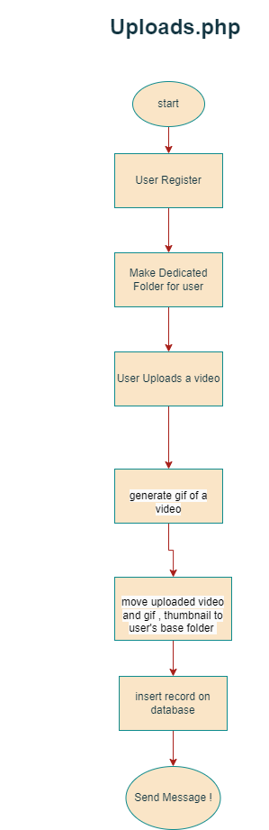
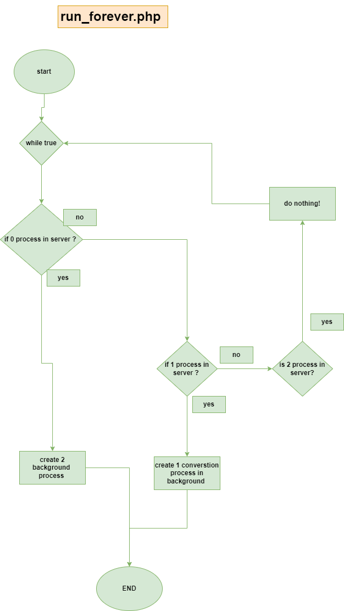

# Video Management Web Application

###### The topic for this project is one of the previously asked questions in rtcamp solutions and this question quite interests me so that's why I created this project to brush up my skills in PHP javascript. I love challenging works that push me to work hard and not give up. it always teaches me so many things while creating projects.

## Project Defination
```
Video Encoding Challenge
This is more like building your own YouTube. 🎥
Please create an interactive JavaScript/React app which has:

1.Upload: Option to upload video in any format. Since videos are large, the uploader should show progress.

2.Convert: On successful upload video, the server-side (PHP) process should encode video into mp4 format in the background. Basically, after the video upload is complete, a user will simply close the browser. But when they come back later they should see video available in multiple formats. You can use FFMPEG to encode videos.

3.Thumbnail: For videos that are successfully converted, display thumbnails like YouTube homepage shows. Once anyone hovers on thumbnails, a small GIF should play automatically so people can see the content of the video without watching the entire video.

4.Watermark: For uploaded video — a user can provide watermark text — give an option for the user to specify text — and use user-provided text to add that in the video as watermark.

```

## My Solution :-

1.Upload Functionality :- <br><br>
  -> it mentioned that video is large and we need to show progress so that's why i choose javascript to do this work since we can use XMLHttpRequest object for upload and also we can know upload size and progress of upload.
 
 Refer :- <a href="./upload.php">Upload.php</a>
 
 2.Convertion Process :- 
  
  -> This part is a little bit tricky and quite interesting and challenging for me since I need to use **ffmpeg and background processing**.<br>
  -> so basically i need to encode video (i change defination little bit ) so i am converting mp4 into mkv,avi,webm.<br>
  -> So here is my solution :- 
   
   </img>
   <br>
   ## Workflow of run_forever.php
   </img>
   
   ```
   
   There will be 3 possible value of database field.
   0  -> video is not in converstion process.
   -1 -> video is currently in converstion process.
   1  -> video is converted.
   
   ```
